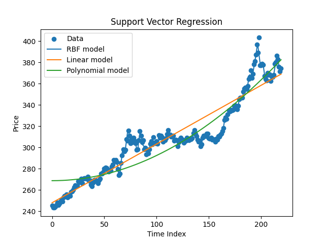
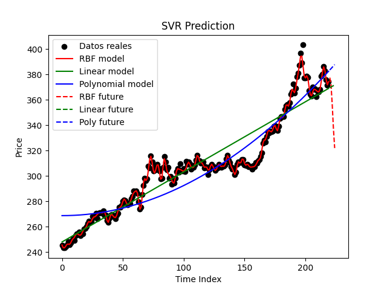
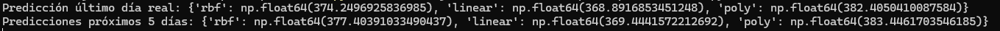

# Gold Price Predictor using SVM

This repository contains a **Python script** for predicting **future stock or ETF prices** using **Support Vector Regression (SVR)**. While it can be applied to any stock, in this project and in the sample outputs the predictions are based on the **GLD gold ETF (NYSEARCA)**. Historical daily closing prices from **2025-01-01 to 2025-11-19** were obtained directly from Google Finance.

---

## Data Acquisition

To download historical stock or ETF data in Google Sheets, you can use the following formula:

** =GOOGLEFINANCE("NYSEARCA:GLD"; "close"; DATE(2025;1;1); TODAY()) **

**Replace `"NYSEARCA:GLD"` with any other stock ticker if needed.**  
This retrieves the daily closing prices from the start date until today.  

Export the sheet as CSV to use with the script.

---

## Technical Description

- **Goal:** Predict the next-period price and the next 5-period prices of a stock/ETF based on historical closing data.  
- **Data Processing:** Converts dates to proper datetime objects, formats prices as floats, and creates an index for the time series.  
- **Models:** Trains three types of Support Vector Regression models:
  - **Linear SVR** – fits a straight line trend.
  - **Polynomial SVR (degree 2)** – captures simple curved trends.
  - **RBF SVR (Gaussian kernel)** – models non-linear, more complex patterns.
- **Visualization:** Generates plots showing historical prices along with model predictions and future forecasts.  
- **Predictions:** Provides numeric output for the last observed day and the next 5 periods.  

---

## Libraries Used

- `pandas` – data manipulation and CSV reading.  
- `numpy` – numerical operations and array reshaping.  
- `matplotlib` – plotting historical data and model predictions.  
- `scikit-learn (sklearn.svm)` – implementation of SVR models.  

---

## Sample Outputs

### Historical Data and SVR Models
This image shows the historical prices along with the predictions from the three SVR models (RBF, Linear, Polynomial).

### Predictions vs Real Data
This image compares the models’ predictions against the actual data and shows the forecasted prices for the next 5 periods.

### Terminal Predictions
A screenshot of the console output showing numeric predictions for the last real day and the next 5 periods.

**Note:** In the example, the Linear and Polynomial models show a price increase, while the RBF model (better fitted to real values) predicts a rise in the next period followed by a sharp drop. Actual predictions will vary depending on the dataset and stock/ETF used.

